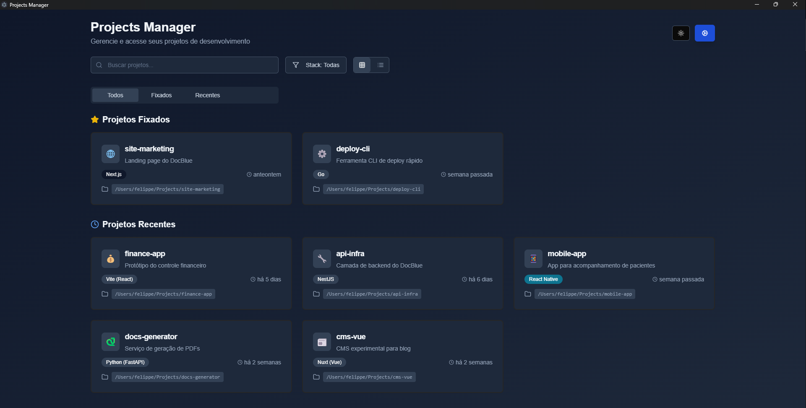

# Projects Manager

Gerencie e acesse seus projetos de desenvolvimento de forma rápida e visual.



---

## Índice

1. [Descrição](#descrição)  
2. [Funcionalidades](#funcionalidades)  
3. [Tecnologias](#tecnologias)  
4. [Requisitos](#requisitos)  
5. [Instalação](#instalação)  
6. [Scripts disponíveis](#scripts-disponíveis)  
7. [Uso](#uso)  
8. [Contribuição](#contribuição)  

---

## Descrição

O **Projects Manager** é uma aplicação desktop/web que permite visualizar, buscar e organizar todos os seus projetos de desenvolvimento em um único lugar. Com uma interface moderna em modo escuro, você pode:

- Pesquisar projetos pelo nome.  
- Filtrar por stack de tecnologia (Next.js, Node.js, Vite etc.).  
- Alternar entre visualização em grade (cards) e lista.  
- Fixar projetos favoritos para acesso rápido.   

Ideal para quem mantém múltiplos repositórios locais e quer um dashboard centralizado para gerenciar seu fluxo de trabalho.

---

## Funcionalidades

- **Busca em tempo real**: digite parte do nome para filtrar instantaneamente.  
- **Filtro de stacks**: selecione uma tecnologia para ver apenas projetos que a utilizam.  
- **Modo de visualização**: escolha entre grade (visual mais rico) ou lista (compacta).  
- **Projetos fixados**: marque seus projetos favoritos; ficam sempre no topo.  
- **Projetos recentes**: acesso rápido aos últimos editados.  
- **Dark mode**: visual confortável para longas sessões de trabalho.  

---

## Tecnologias

- **Frontend**: React / Next.js  
- **Estilização**: Tailwind CSS  
- **Backend**: Node.js (API de leitura do sistema de arquivos)  
- **Empacotamento**: Electron  
- **Build**: tsup  
- **Gerenciamento de estado**: Context API  

---

## Requisitos

- [Node.js](https://nodejs.org/) v14+  
- NPM  
- Electron 

---

## Instalação

1. Clone este repositório:  
   ```bash
   git clone https://github.com/lippelima5/manager
   cd manager


2. Instale as dependências:

   ```bash
   npm install
   ```

---

## Scripts disponíveis

| Comando                        | Descrição                                                       |
| ------------------------------ | --------------------------------------------------------------- |
| `npm run dev`                  | Roda em paralelo o Next.js e o Electron em modo desenvolvimento |
| `npm run next:dev`             | Inicia o front-end Next.js em modo dev                          |
| `npm run next:build`           | Gera o build de produção do Next.js                             |
| `npm run next:start`           | Inicia o servidor Next.js a partir do build                     |
| `npm run next:lint`            | Executa o lint nos arquivos do Next.js                          |
| `npm run format`               | Formata o código usando dprint                                  |
| `npm run postinstall`          | Instala dependências nativas necessárias do Electron            |
| `npm run electron:dist`        | Empacota o app Electron em modo diretório                       |
| `npm run electron:dist:deb`    | Empacota o app Electron em `.deb` para Linux                    |
| `npm run electron:build`       | Compila o código TS do Electron (via tsup)                      |
| `npm run build`                | Executa `next:build` + `electron:build`                         |
| `npm run dist`                 | Executa `build` + `electron:dist`                               |
| `npm run electron:dev`         | Roda em paralelo o watch do Electron e o build contínuo         |
| `npm run electron:build_watch` | Compila o Electron em modo watch                                |
| `npm run electron:watch`       | Inicia o Electron em modo desenvolvimento com nodemon           |

---

## Uso

### Desenvolvimento

```bash
npm run dev
```

Isso inicia:

* **Next.js** em `http://localhost:3000`
* **Electron** apontando para sua instância local

### Build e Empacotamento

1. Gere o front-end e a build do Electron:

   ```bash
   npm run build
   ```
2. Empacote em diretório:

   ```bash
   npm run electron:dist
   ```
3. (Opcional) Gere `.deb` para Linux:

   ```bash
   npm run electron:dist:deb
   ```

Os artefatos finais ficarão na pasta `dist/`.

---

## Contribuição

1. Faça um *fork* deste repositório.
2. Crie uma branch para sua feature ou correção:

   ```bash
   git checkout -b feature/nome-da-sua-feature
   ```
3. Faça as alterações e commit:

   ```bash
   git commit -m "🔧 Adiciona feature X"
   ```
4. Envie para o seu *fork*:

   ```bash
   git push origin feature/nome-da-sua-feature
   ```
5. Abra um *Pull Request* descrevendo suas mudanças.

---


